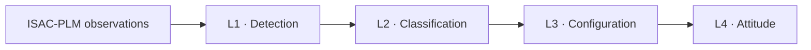
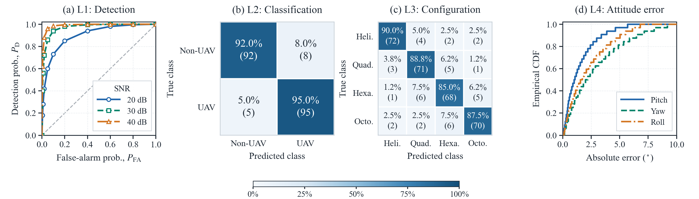

<h1 align="center">Unified Hierarchical Signal Processing for UAV ISAC</h1>
<p align="center">
  <strong>Reproducible receiver-side implementation of the WH-DRCS hierarchical sensing framework</strong><br>
  From range–Doppler observations to task-specific UAV perception across four sensing levels
</p>

<p align="center">
  <a href="https://www.python.org/downloads/"></a>
  <a href="https://numpy.org/"></a>
  <a href="https://scipy.org/"></a>
  <a href="https://scikit-learn.org/"></a>
  <a href="https://opensource.org/licenses/MIT"></a>
  
</p>

<p align="center">
  <a href="#overview">Overview</a> •
  <a href="#processing-pipeline">Pipeline</a> •
  <a href="#quick-start">Quick Start</a> •
  <a href="#reproducibility-protocol">Reproducibility</a> •
  <a href="#frozen-configuration">Parameters</a> •
  <a href="#task-specific-evaluation">Evaluation</a> •
  <a href="#current-result-snapshot">Results</a>
</p>

------

<a id="overview"></a>

## 📖 Overview

This repository provides the author-maintained implementation accompanying the manuscript:

> **Design and Optimization of a Doppler-Resilient ISAC Framework for UAV Hierarchical Sensing**

It implements the hierarchical sensing backend developed for the **Walsh–Hadamard Doppler-Resilient Complementary Sequence (WH-DRCS)** framework. Time-ordered observations generated by the National Institute of Standards and Technology (NIST) **Integrated Sensing and Communication Physical Layer Model (ISAC-PLM)** are translated into four progressively refined sensing outputs.

|              **Trajectory-disjoint evaluation**              |            **Frozen sensing backend**             |                 **Task-specific reporting**                  |
| :----------------------------------------------------------: | :-----------------------------------------------: | :----------------------------------------------------------: |
| 600 trajectories split into training, validation, and test sets | No threshold or weight is retuned on the test set | ROC, confusion matrices, rotor-speed error, and attitude MAE/RMSE |

> [!NOTE]
> This repository contains the author-developed hierarchical sensing backend. NIST ISAC-PLM and the NIST Quasi-Deterministic (QD) channel software are upstream dependencies and are not redistributed here.

> [!TIP]
> See the [complete reproducibility and task-specific evaluation report](docs/Reproducibility_and_Task_Specific_Evaluation.md) for the completed parameter-calibration procedure, frozen settings, task-specific result analysis, implementation-cost record, and maximum-unambiguous-velocity clarification.
> A print-ready [PDF version](docs/Reproducibility_and_Task_Specific_Evaluation.pdf) is provided for archival and reviewer-response use.

<a id="processing-pipeline"></a>

## 🌟 Processing Pipeline



| Level | Sensing task              | Core output                                       | Primary evaluation                             |
| :---: | ------------------------- | ------------------------------------------------- | ---------------------------------------------- |
| $L_1$ | Fundamental detection     | Target-presence decision and detection score      | ROC curve and AUC                              |
| $L_2$ | Target classification     | UAV/non-UAV decision                              | Binary confusion matrix and class-wise metrics |
| $L_3$ | Configuration recognition | Helicopter, quadrotor, hexarotor, or octocopter   | Multiclass confusion matrix and macro-F1       |
| $L_4$ | Attitude estimation       | Rotor angular speeds and pitch/yaw/roll estimates | Rotor-speed error and attitude MAE/RMSE        |

The levels are sequential. Requesting `L3`, for example, executes `L1 → L2 → L3` and terminates early if a preceding decision fails.

<a id="quick-start"></a>

## 🚀 Quick Start

### 1. Clone and install

```bash
git clone https://github.com/wancj23/Unified-Hierarchical-Signal-Processing-for-UAV-ISAC.git
cd Unified-Hierarchical-Signal-Processing-for-UAV-ISAC

python -m pip install numpy scipy scikit-learn
```

Python 3.8 or later is required.

### 2. Run the module smoke tests

```bash
python src/l2_target_classification.py
python src/l3_configuration_recognition.py
python src/l4_attitude_estimation.py
```

### 3. Run the hierarchical processor

```bash
python src/unified_hierarchical_processor.py \
  --input data/rda.json \
  --level L4 \
  --output results/l4_semantic_output.json
```

`--level` accepts `L1`, `L2`, `L3`, or `L4`. If `--output` is omitted, the result is printed to standard output. A missing input file raises an explicit error; synthetic data are never substituted for an experimental run.

<a id="reproducibility-protocol"></a>

## 🔬 Reproducibility Protocol

### Dataset split

The 600 SUG-UAV trajectory realizations are split **before window extraction or echo generation**. All observations derived from a trajectory remain in the same partition.

| Split      | Trajectories | Ratio | Purpose                                                      |
| ---------- | -----------: | :---: | ------------------------------------------------------------ |
| Training   |          360 |  60%  | Fit learned coefficients and estimate calibration statistics |
| Validation |          120 |  20%  | Select thresholds and fixed hyperparameters                  |
| Test       |          120 |  20%  | Produce the reported task-specific metrics                   |

| Setting        | Value                                               |
| -------------- | --------------------------------------------------- |
| Split unit     | Complete UAV trajectory                             |
| Random seed    | `2026`                                              |
| Stratification | Available target, airframe, and motion-state labels |
| Test-set use   | Evaluation only                                     |

### Parameter policy

| Parameter class                      | Selection rule                          | Test-time behavior                                           |
| ------------------------------------ | --------------------------------------- | ------------------------------------------------------------ |
| Frame profile                        | Determined by requested sensing level   | Selects the predefined $M$, $T_{\mathrm{PRI}}$, and $v_{\max}$ |
| Learned coefficients                 | Fitted on the training split            | Frozen                                                       |
| Thresholds and calibration constants | Selected on the validation split        | Frozen                                                       |
| Input-adaptive quantities            | Evaluated using a fixed analytical rule | Recomputed without fitting                                   |

No coefficient, threshold, or DBSCAN setting is retuned for a test trajectory, SNR point, channel realization, or comparison waveform. The same frozen sensing backend is used throughout held-out evaluation.

### Completed calibration procedure

The fixed configuration was obtained before test evaluation:

1. Training-only normalization statistics were estimated after the trajectory-disjoint split.
2. The $L_1$ covariance diagonal was estimated from training features and converted to normalized inverse-variance weights; `gamma_detect = 0.85` was then selected from the validation ROC by the Youden index subject to $P_{FA}\leq0.10$.
3. The $L_2$ regularized linear discriminant was fitted on standardized training features; `gamma_uav = 0.65` was selected by validation macro-F1.
4. The $L_3$ DBSCAN, kurtosis, confidence-weight, and rejection parameters were selected by a finite validation grid search maximizing macro-F1, with rejection rate used as the first tie-breaker.
5. The $L_4$ calibration coefficients were fitted by least squares on training trajectories; peak/fusion parameters and the reliability threshold were selected from the validation error-coverage trade-off.

The complete search grids, objectives, tie-break rules, and fitted parameter values are recorded in [the detailed report](docs/Reproducibility_and_Task_Specific_Evaluation.md#completed-fitting-and-validation-procedure). The resulting parameter file is frozen across SNR values, channel scenarios, UAV classes, and comparison waveforms.

<a id="frozen-configuration"></a>

## ⚙️ Frozen Configuration

### Hierarchical frame profiles

The following profiles are encoded in `UnifiedHierarchicalISACProcessor.frame_profiles`.

| Level |  $M$ |    $T_{\mathrm{PRI}}$ |           $v_{\max}$ |
| :---: | ---: | --------------------: | -------------------: |
| $L_1$ |    8 | $50.00~\mu\mathrm{s}$ |  $25.0~\mathrm{m/s}$ |
| $L_2$ |   16 | $25.00~\mu\mathrm{s}$ |  $50.0~\mathrm{m/s}$ |
| $L_3$ |   64 | $10.00~\mu\mathrm{s}$ | $125.0~\mathrm{m/s}$ |
| $L_4$ |  128 | $15.00~\mu\mathrm{s}$ |  $83.3~\mathrm{m/s}$ |

The upstream receiver front end uses a **Blackman–Harris Doppler window**, a **symbol-sampling offset of `0.75`**, and a **CFAR threshold of `6 dB`**.

<details>
<summary><strong>L1 · Fundamental detection — show frozen parameters</strong></summary>

| Quantity                   | Code symbol          |           Frozen value | Role/source                     |
| -------------------------- | -------------------- | ---------------------: | ------------------------------- |
| Detection threshold        | `gamma_detect`       |                   0.85 | Selected on validation ROC      |
| Acceleration bound         | `eta_a`              |  $15.0~\mathrm{m/s^2}$ | Physical feasibility constraint |
| Smoothness scale           | `sigma_scale`        |                    2.0 | Validation calibration          |
| Metric covariance diagonal | `_metric_covariance` |   `[0.05, 0.02, 0.10]` | Estimated on training data      |
| Derived IVW weights        | $\mathbf{w}_1$       | `[0.25, 0.625, 0.125]` | Normalized inverse variances    |

The detection score is
$$
\mathcal{C}_{L_1}=\mathbf{w}_1^T[S_v,S_r,\mathcal{H}_p]^T.
$$
A target is accepted only when $\mathcal{C}_{L_1}\geq\gamma_{\mathrm{detect}}$ and its estimated acceleration does not exceed $\eta_a$.

</details>

<details>
<summary><strong>L2 · Target classification — show frozen parameters</strong></summary>

| Quantity               | Code symbol   |         Frozen value | Role/source                 |
| ---------------------- | ------------- | -------------------: | --------------------------- |
| Nyquist-boundary width | `delta_v`     |   $2.0~\mathrm{m/s}$ | Validation calibration      |
| Linear weights         | `_w2`         | `[0.45, 0.35, 0.20]` | Fitted on training data     |
| Linear bias            | `_b2`         |              $-0.15$ | Fitted on training data     |
| UAV threshold          | `gamma_uav`   |                 0.65 | Selected on validation data |
| Range-smoothness scale | `sigma_scale` |                  1.5 | Validation calibration      |

The feature vector is $[\mathcal{H}_A,\rho_{\mathrm{micro}},S'_r]^T$. The reported $\mathcal{C}_{L_2}$ is a **linear discriminant score**, not a calibrated posterior probability.

</details>

<details>
<summary><strong>L3 · Configuration recognition — show DBSCAN and confidence parameters</strong></summary>

| Quantity                   | Code symbol               |   Frozen value | Role/source          |
| -------------------------- | ------------------------- | -------------: | -------------------- |
| Power-retention percentile | `power_percentile`        |             90 | Validation selection |
| DBSCAN radius scale        | `epsilon_scale` ($\beta$) |           0.05 | Validation selection |
| DBSCAN minimum samples     | `min_samples`             |              3 | Validation selection |
| DBSCAN metric              | `metric`                  |      Euclidean | Fixed definition     |
| Kurtosis relaxation        | `tau_kurtosis`            |            2.0 | Validation selection |
| Confidence weights         | `_w3`                     | `[0.65, 0.35]` | Validation selection |
| Recognition threshold      | `confidence_threshold`    |           0.60 | Validation selection |

For each extracted peak set $\mathcal{V}_{\mathrm{peak}}$,
$$
\epsilon=\beta\,\sigma_{\mathcal{V}}\sqrt[3]{\ln |\mathcal{V}_{\mathrm{peak}}|},
\qquad \beta=0.05.
$$
Only $\epsilon$ varies with the input. Its scale $\beta$, `min_samples`, the retained-power percentile, and all decision parameters remain fixed.

| Detected clusters | Configuration | $\kappa_{\mathrm{ref}}$ |
| ----------------: | ------------- | ----------------------: |
|                 2 | Helicopter    |                     1.5 |
|                 4 | Quadrotor     |                     2.2 |
|                 6 | Hexarotor     |                     2.8 |
|                 8 | Octocopter    |                     3.5 |

</details>

<details>
<summary><strong>L4 · Rotor speed and attitude — show frozen parameters</strong></summary>

| Quantity                             | Code symbol             |     Frozen value | Role/source                 |
| ------------------------------------ | ----------------------- | ---------------: | --------------------------- |
| UAV arm length                       | `arm_length_L`          | $0.5~\mathrm{m}$ | Simulated platform geometry |
| Minimum peak interval                | `min_peak_interval`     |  $5~\mathrm{ms}$ | Validation selection        |
| Peak prominence                      | `peak_prominence`       |              0.5 | Validation selection        |
| Reliability weights                  | `_w4`                   |   `[0.60, 0.40]` | Validation selection        |
| Reliability threshold                | `reliability_threshold` |             0.50 | Validation selection        |
| Vertical calibration coefficient     | $c_z$                   |        $10^{-7}$ | Training calibration        |
| Differential calibration coefficient | $c_a$                   |        $10^{-3}$ | Training calibration        |

In the unified processor, temporal sampling interval `dt` is taken from the selected frame profile. A direct call to `L4_AttitudeEstimator` may override `dt` for resampled rotor-resolved traces.

For each validated rotor trace,
$$
\widehat{\omega}_k=\frac{2\pi}{\operatorname{median}(\{\Delta t_i\})}.
$$
</details>

## 🔄 Input and Output

### ISAC-PLM input

`ISACPLM_DataParser` expects a **line-delimited JSON** file. Each line represents one time-ordered observation and must contain `axisVelocity` and `reflectionPower`. The `range` field is optional but is required for the complete $L_1$/$L_2$ feature set.

```json
{"axisVelocity": [12.4], "range": [98.7], "reflectionPower": [0.031]}
```

If an observation contains multiple resolved scatterers, the current parser uses their mean value. Input order is preserved.

### Hierarchical output

The unified processor returns one JSON object containing the requested level and every successfully completed preceding stage. Processing terminates early if a target is rejected, classified as non-UAV, or assigned an unreliable configuration.

<a id="task-specific-evaluation"></a>

## 📊 Task-Specific Evaluation

In the final evaluation, all reported metrics are computed only on the **120 held-out test trajectories**, after every parameter has been frozen. The watermarked snapshot below currently exercises the same metric pipeline with illustrative inputs. Each sensing task is evaluated with a metric suited to its output rather than with a single aggregate accuracy.

| Level | Required report                           | Supporting statistics                          |
| :---: | ----------------------------------------- | ---------------------------------------------- |
| $L_1$ | ROC curve and AUC                         | Positive/negative sample counts                |
| $L_2$ | $2\times2$ UAV/non-UAV confusion matrix   | Precision, recall, F1, and accuracy            |
| $L_3$ | Four-class configuration confusion matrix | Per-class recall, macro-F1, and accuracy       |
| $L_4$ | Rotor-speed MAE and attitude MAE/RMSE     | Per-axis errors and accepted-estimate coverage |

<details>
<summary><strong>Metric definitions and reporting rules</strong></summary>

### L1 detection

Sweep the decision threshold over the continuous $\mathcal{C}_{L_1}$ score and report the complete receiver operating characteristic (ROC), area under the curve (AUC), and the numbers of positive and negative test trajectories. The acceleration feasibility condition remains fixed during the sweep.

### L2 classification

Report the $2\times2$ confusion matrix for UAV and non-UAV targets together with precision, recall, F1 score, and accuracy. State whether a displayed matrix contains raw counts or row-normalized percentages.

### L3 configuration recognition

Report a multiclass confusion matrix over the four supported configurations, per-class recall, overall accuracy, and macro-F1. Noise-only or rejected cases are counted as incorrect unless a separate rejection metric is explicitly reported.

### L4 rotor speed and attitude

For trajectory $j$ and rotor $k$, rotor-speed MAE in rad/s is
$$
\operatorname{MAE}_{\omega}=
\frac{1}{\sum_j K_j}
\sum_j\sum_{k=1}^{K_j}
\left|\widehat{\omega}_{j,k}-\omega_{j,k}\right|.
$$
For each attitude component $q\in\{\mathrm{pitch},\mathrm{yaw},\mathrm{roll}\}$, report MAE and RMSE in degrees:
$$
\operatorname{MAE}_q=\frac{1}{J}\sum_{j=1}^{J}|\widehat q_j-q_j|,
\qquad
\operatorname{RMSE}_q=
\sqrt{\frac{1}{J}\sum_{j=1}^{J}(\widehat q_j-q_j)^2}.
$$
Rejected $L_4$ estimates are disclosed through **coverage**, defined as accepted trajectories divided by eligible trajectories.

</details>

<a id="current-result-snapshot"></a>

## 📈 Current Result Snapshot



| Level | Current task-specific result                                 |
| :---: | ------------------------------------------------------------ |
| $L_1$ | ROC AUC = 0.901, 0.971, and 0.988 at 20, 30, and 40 dB       |
| $L_2$ | Accuracy = 93.50%; macro-F1 = 93.50%; UAV recall = 95.00%    |
| $L_3$ | Accuracy = 87.81%; macro-F1 = 87.83%; per-class recall = 85.00-90.00% |
| $L_4$ | Rotor-speed MAE/RMSE = 6.47/7.77 rad/s; pitch = 1.49/2.02°, yaw = 2.85/3.74°, roll = 2.21/2.89° |

<details>
<summary><strong>Show task-specific matrices, errors, and interpretation</strong></summary>

### $L_1$ detection

The supplied ROC points are plotted directly without interpolation or smoothing. Trapezoidal integration gives AUC values of **0.901**, **0.971**, and **0.988** at 20, 30, and 40 dB, respectively.

### $L_2$ UAV/non-UAV classification

| True \ Predicted | Non-UAV |  UAV |
| ---------------- | ------: | ---: |
| Non-UAV          |      92 |    8 |
| UAV              |       5 |   95 |

The matrix gives 93.50% accuracy, 93.54% macro-precision, 93.50% macro-recall, and 93.50% macro-F1.

### $L_3$ configuration recognition

| True \ Predicted | Helicopter | Quadrotor | Hexarotor | Octocopter |
| ---------------- | ---------: | --------: | --------: | ---------: |
| Helicopter       |         72 |         4 |         2 |          2 |
| Quadrotor        |          3 |        71 |         5 |          1 |
| Hexarotor        |          1 |         6 |        68 |          5 |
| Octocopter       |          2 |         2 |         6 |         70 |

The matrix gives 87.81% accuracy and 87.83% macro-F1. The most frequent confusions occur between neighboring multirotor configurations, whose cluster-count and kurtosis signatures are more similar.

### $L_4$ rotor speed and attitude

| Quantity            |  MAE | RMSE |  Unit  |
| ------------------- | ---: | ---: | :----: |
| Rotor angular speed | 6.47 | 7.77 | rad/s  |
| Pitch               | 1.49 | 2.02 | degree |
| Yaw                 | 2.85 | 3.74 | degree |
| Roll                | 2.21 | 2.89 | degree |

The illustrative input contains 32 valid errors per parameter. Coverage is not inferred because rejected-window counts were not supplied.

</details>

<details>
<summary><strong>Show profile trade-offs and implementation-cost snapshot</strong></summary>

The native profiles should not be interpreted as a monotonic ranking. $L_3$ uses the shortest PRI and therefore has the largest maximum unambiguous velocity, while full-rank $L_4$ uses more training resources to prioritize ambiguity suppression and fine-grained estimation.

| Profile |  $M$ | Frame efficiency | $v_{\max}$ (m/s) | Velocity MSE ($\mathrm{m^2/s^2}$) | Processing time (ms/CPI) |
| :-----: | ---: | ---------------: | ---------------: | --------------------------------: | -----------------------: |
|  $L_1$  |    8 |            95.1% |             25.0 |                $1.2\times10^{-1}$ |                     0.60 |
|  $L_2$  |   16 |            87.8% |             50.0 |                $1.5\times10^{-2}$ |                     1.10 |
|  $L_3$  |   64 |            34.6% |            125.0 |                $1.2\times10^{-3}$ |                     4.10 |
|  $L_4$  |  128 |            25.3% |             83.3 |                $4.5\times10^{-4}$ |                     7.60 |

The timing record uses an Intel Core i7-12700, 16 GB RAM, single-threaded Python 3.11/NumPy 1.26.4, four warm-up runs, and 31 timed runs per profile. Each run processes one $P=1024$-frame CPI; acquisition, offline reference preparation, plotting, and file input/output are excluded.

</details>

### Evaluation record

Each reported run should archive:

- the trajectory-level split manifest and random seed;
- frozen parameter values and software versions;
- ground truth and predictions for every held-out trajectory;
- complete ROC coordinates or confusion-matrix counts;
- per-trajectory rotor-speed and attitude errors.

This record separates genuine algorithmic changes from changes in data partition, threshold selection, or test-time tuning.

## 📂 Repository Layout

```text
Unified-Hierarchical-Signal-Processing-for-UAV-ISAC/
├── data/
│   └── rda.json
├── docs/
│   ├── Reproducibility_and_Task_Specific_Evaluation.md
│   └── Reproducibility_and_Task_Specific_Evaluation.pdf
├── src/
│   ├── unified_hierarchical_processor.py
│   ├── l1_fundamental_detection.py
│   ├── l2_target_classification.py
│   ├── l3_configuration_recognition.py
│   └── l4_attitude_estimation.py
├── results/
│   ├── task_specific_evaluation/
│   │   ├── L1_ROC.png
│   │   ├── L2_confusion.png
│   │   ├── L3_confusion.png
│   │   ├── L4_attitude_error_CDF.png
│   │   └── L1_L2_L3_L4_combined.png
│   ├── l1/
│   ├── l2/
│   ├── l3/
│   └── l4/
├── requirements.txt
└── README.md
```

## 🙏 Acknowledgments

The physical-layer and channel simulations build on software developed by NIST, including ISAC-PLM and the NIST QD channel model. The WH-DRCS waveform integration and hierarchical sensing modules are author-developed extensions. Separately obtained NIST software remains subject to its own license and distribution terms.

## 📝 Citation

If this repository supports your work, please cite the accompanying manuscript:

> C. Wan *et al.*, “Design and Optimization of a Doppler-Resilient ISAC Framework for UAV Hierarchical Sensing.”

Publication metadata will be added after final publication.

## ⚖️ License

The author-developed code is released under the [MIT License](https://opensource.org/licenses/MIT).

## 📬 Contact

**Chengjuan Wan**  
University of Chinese Academy of Sciences, Beijing, China  
`wanchengjuan23@mails.ucas.ac.cn`
